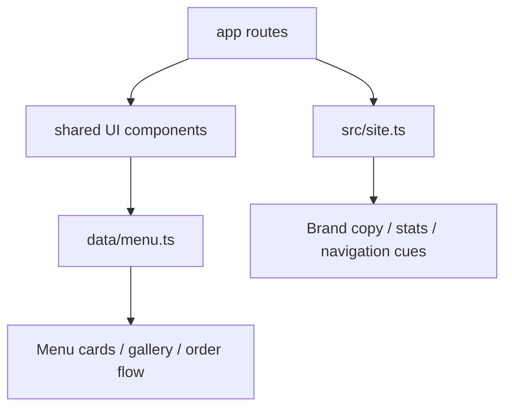
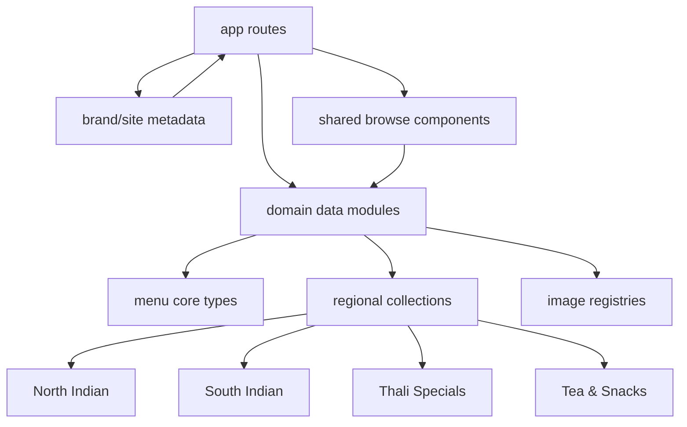
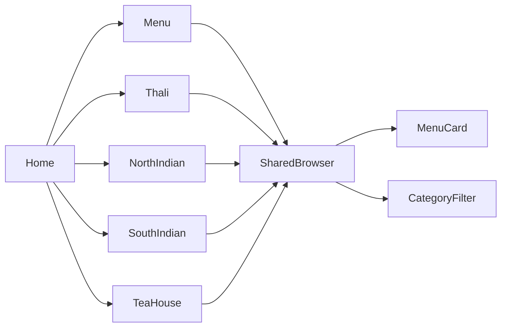

# AKA-82 Architect Plan — Indian Menu Expansion

## Terminal log
- inspected `package.json` → Next.js 14 App Router, React 18, TypeScript, Tailwind CSS
- inspected `data/menu.ts` → single static menu feed with 100 items across 4 categories
- inspected `app/page.tsx` → homepage highlights featured items + route cards
- inspected `components/MenuBrowser.tsx` → category filtering is flat and category-count driven
- inspected `src/site.ts` + `components/Navbar.tsx` → brand metadata and primary IA are centrally defined
- created this plan artifact only; no product code changed in architect phase

---

## Executive summary
The current app is a solid static-content restaurant site, but it is architected around a **generic Western menu model**:
- categories are only `Starters | Mains | Desserts | Drinks`
- image assignment is recycled from 4 small category image pools
- site identity is `Juniper Table`, not Indian cuisine
- IA exists, but it does not express Indian browsing intents like **thali**, **regional cuisine**, or **tea/snacks**

The requested change is not just “add more items.” It is a **domain reshaping** to an Indian restaurant/catalog experience with:
- at least **100 additional high-quality entries**
- stronger image diversity
- regional browsing for **Indian thali / South Indian / North Indian / tea**
- more supporting pages so the site feels purpose-built rather than relabeled

Recommended approach: **keep the static local-data architecture**, but evolve the content model from a flat menu into a **region-aware, service-aware catalog**. This preserves delivery speed while making future growth cheap.

---

## Current architecture snapshot



### Stack
- **Framework:** Next.js 14 App Router
- **UI:** React 18 + Tailwind CSS
- **Data source:** local TypeScript static arrays
- **State:** client-side React state for menu filtering/cart UX
- **Deployment model:** static-ish application, no backend/API dependency

### Strengths
- Low complexity
- Fast to modify
- Zero backend coupling
- Easy to review/test in isolation

### Constraints
- Menu taxonomy is too shallow for Indian cuisine
- Image strategy does not scale well to 200+ visually distinct entries
- Current routes reflect generic hospitality browsing, not regional food discovery
- Brand metadata is too centralized and monolithic for multi-section cuisine storytelling

---

## Problem framing
User intent, translated into architecture requirements:

1. **“feed data atleast 100 more”**
   - expand from 100 → ~200+ total items
   - preserve browse performance and maintainability

2. **“good quality images”**
   - improve image coverage and avoid obvious repetition
   - align images to cuisine sections, not only broad category buckets

3. **“add some more pages”**
   - expand IA with cuisine/collection pages that support discovery

4. **“create for indian thali, south indian, north indian, tea”**
   - introduce domain vocabulary and browsing paths for Indian cuisine
   - likely include breakfast/snack/beverage subdomains naturally associated with tea service

---

## Recommended target architecture



### Architectural direction
Do **not** introduce a backend or CMS in this phase. That would add complexity without clear payoff.

Instead:
- keep local static data
- split menu data into **modular domain files**
- enrich the schema with **regional and meal-experience metadata**
- add route-level landing pages for major cuisine clusters

This keeps the dependency graph simple and acyclic.

---

## ADR-001 — Evolve from flat category model to region-aware menu domain

**Status:** Proposed  
**Decision owner:** Architect  
**Required by:** AKA-82

### Context
Current menu items only support broad Western categories. Indian cuisine needs browsing by both **food type** and **regional style**.

### Decision
Extend the menu domain model to support:
- `category` (existing concept, broadened)
- `cuisineRegion` (North Indian, South Indian, Pan-Indian)
- `serviceType` (Thali, Tea, Breakfast, Curry House, Street Snack, Dessert, Beverage)
- optional `tags` (vegetarian, Jain-friendly, spicy, festive, tandoor, dosa, chai, etc.)

### Proposed type shape
```ts
export type MenuCategory =
  | 'Starters'
  | 'Curries'
  | 'Breads'
  | 'Rice & Biryani'
  | 'Thali'
  | 'South Indian'
  | 'Chaat & Snacks'
  | 'Desserts'
  | 'Tea & Beverages';

export type CuisineRegion = 'North Indian' | 'South Indian' | 'Pan-Indian';
export type ServiceType = 'À la carte' | 'Thali' | 'Breakfast' | 'Tea Time';
```

### Rationale
This gives us multiple orthogonal browse dimensions without requiring a database.

### Trade-offs
- **Pros:** flexible browsing, future-safe content model, still static/simple
- **Cons:** slightly more UI branching, more seed-data discipline required

### Rollback plan
If implementation gets too large, retain existing `category` UI and add only `cuisineRegion` + new pages using filtered views. No breaking API changes required.

### Observability
Because there is no backend, observability here means code-level auditability:
- deterministic static datasets
- explicit counts per region/category in UI
- build should fail on TypeScript schema mismatch

---

## ADR-002 — Add cuisine landing pages instead of overloading one mega menu page

**Status:** Proposed

### Context
A single `/menu` page can show everything, but it becomes cognitively dense around 200+ items.

### Decision
Keep `/menu` as the master catalog, and add dedicated landing pages for the highest-intent cuisine clusters:
- `/thali`
- `/north-indian`
- `/south-indian`
- `/tea-house` or `/tea`

### Rationale
This matches user intent and creates stronger entry points from home/nav/cards.

### Trade-offs
- **Latency:** negligible; still static pages
- **Complexity:** low-medium; reuse existing components with filtered data
- **Risk:** low

### Rollback plan
If time is tight, implement the pages as thin wrappers over shared browse components using filtered props.

### Observability
Each page should surface visible counts and section labels so content completeness can be verified manually.

---

## ADR-003 — Replace tiny reused image pools with section-scoped image registries

**Status:** Proposed

### Context
Current images rotate from small pools, which will feel repetitive at 200+ items and across culturally specific dishes.

### Decision
Create image registries by cuisine/service section rather than only by top-level category.

Example buckets:
- `northIndianImages`
- `southIndianImages`
- `thaliImages`
- `teaImages`
- optional finer-grained `biryaniImages`, `chaatImages`, `dessertImages`

### Rationale
Better visual alignment and less obvious repetition with minimal runtime cost.

### Trade-offs
- **Pros:** better perceived quality
- **Cons:** larger static file / URL list, manual curation effort

### Rollback plan
If image sourcing becomes the bottleneck, prioritize distinct pools for the 4 requested domains first, then share some images across adjacent subcategories.

### Observability
Manual QA checklist should verify that hero/gallery/page cards do not repeat the same image too aggressively in one viewport.

---

## Proposed information architecture

### Keep existing routes
- `/`
- `/menu`
- `/gallery`
- `/story`
- `/events`
- `/order`
- `/reservations`
- `/contact`

### Add routes
- `/thali`
- `/north-indian`
- `/south-indian`
- `/tea` or `/tea-house`
- optional: `/catering` or `/family-meals` if time remains and content exists

### Navigation change
Primary nav should prioritize cuisine discovery over generic brand storytelling.

Recommended nav:
- Home
- Menu
- Thali
- North Indian
- South Indian
- Tea House
- Gallery
- Order
- Reservations
- Contact

`Story` and `Events` can remain accessible but should be lower-priority if nav space is tight.

---

## Proposed page/component mapping



### Reuse candidates
Existing components likely reusable with small extension:
- `MenuCard`
- `MenuBrowser`
- `CategoryFilter`
- `ImageShowcase`
- `SectionIntro`
- `StatsStrip`
- `Navbar`

### New components recommended
- `CuisineHighlightGrid` — cards for Thali / North / South / Tea
- `RegionalMenuBrowser` or a generalized `MenuBrowser` with props for filter scope
- `ServiceBadgeRow` — thali, breakfast, tea-time, vegetarian emphasis
- `CollectionHero` — route-specific hero for regional pages

### Avoid
- Do not fork separate bespoke browsers for every page
- Do not create more than one new filtering abstraction if `MenuBrowser` can be generalized

Guardrail alignment: component coupling remains below the requested threshold if all new pages use shared presentational building blocks.

---

## Data design proposal

### Dataset scale target
Current: **100 items**  
Target for AKA-82: **200–220 total items**

Recommended split:
- **North Indian:** +45 to +55 items
- **South Indian:** +35 to +45 items
- **Thali:** +20 to +30 items
- **Tea & tea-time snacks:** +20 to +30 items
- optional supporting additions in desserts/beverages/breads/rice to round the catalog

### Suggested taxonomy
#### North Indian
- curries
- kebabs/tandoor
- breads
- biryani/pulao
- paneer dishes
- festive desserts

#### South Indian
- dosa
- idli
- vada
- uttapam
- rice bowls
- curry specials
- filter coffee / beverage pairings

#### Thali
- veg thali
- deluxe thali
- regional thali
- mini thali
- festival thali
- family thali platters

#### Tea
- masala chai
- adraki chai
- elaichi chai
- cutting chai
- iced tea
- snacks: samosa, kachori, pakora, bun maska, khari, biscuits

### Quality rules for seed data
- avoid duplicate dish names
- descriptions should name the main ingredient/preparation style
- preserve vegetarian/spicy flags accurately
- use prep times that feel plausible
- price bands should be regionally coherent within the site’s imagined market

---

## Scalability assessment

### Growth model
- Users: low-to-medium brochure/ecommerce traffic
- Data: static growth from 100 → 200+ items
- Requests: page-load bound, mostly read-only

### 10x / 100x bottlenecks
- **10x users:** still fine on static pages/CDN delivery
- **100x content:** single monolithic `data/menu.ts` becomes hard to maintain
- **100x routes/features:** nav/content sprawl, not infra, becomes the main issue

### Independent scaling
At this phase, independent runtime scaling is unnecessary. Independent **content-module scaling** is what matters.

Recommendation:
- split `data/menu.ts` into:
  - `data/menu/types.ts`
  - `data/menu/images.ts`
  - `data/menu/north-indian.ts`
  - `data/menu/south-indian.ts`
  - `data/menu/thali.ts`
  - `data/menu/tea.ts`
  - `data/menu/index.ts`

This is the cheapest path to change.

---

## Reliability assessment

### Failure modes
- invalid image URLs → broken cards/gallery
- schema drift across seed modules → build/type failures
- route copy and filters not aligned → misleading browse experience

### Graceful degradation
- if some images fail, text cards should still render cleanly
- if a collection page has fewer items, it still works as filtered content

### Blast radius
- with modular data files, a bad seed file affects one domain more than the whole menu
- with a single shared browser component, a bug there impacts many pages, so keep its changes minimal and tested manually

---

## Maintainability assessment

### One-day comprehension test
A new engineer should be able to understand this in under a day if:
- route pages stay thin
- menu data is split by domain
- filtering props are explicit

### Team ownership boundaries
Clear boundaries:
- `data/menu/*` → content/domain layer
- `components/*` → reusable presentation
- `app/*` → route composition
- `src/site.ts` → global brand/site metadata

### Dependency graph
Should remain acyclic:
- route pages import components + data
- components import types only where needed
- data imports types + image registries
- avoid components importing route files or route files importing each other

---

## Operability assessment

### Zero-downtime deployment
Yes, static Next deployment remains straightforward.

### Runbook for likely issues
1. broken route → check page export under `app/<route>/page.tsx`
2. wrong counts → check aggregated menu export in `data/menu/index.ts`
3. wrong images → check image registry bucket assignment
4. missing nav links → inspect `components/Navbar.tsx`

### Observability requirements
For this static app, add observable UI indicators:
- total menu item count on homepage/menu page
- per-region counts on regional pages
- visible section labels and badges
- consistent CTA paths between pages

---

## Migration plan

### Phase 1 — Domain model refactor
- split monolithic menu data into modular files
- add region/service metadata while preserving compatibility where possible
- keep `MenuCard` item contract stable unless necessary

### Phase 2 — Data expansion
- add 100+ Indian-focused items with curated descriptions
- introduce stronger image registries by section

### Phase 3 — IA expansion
- add `/thali`, `/north-indian`, `/south-indian`, `/tea`
- update navbar + homepage cards
- adjust homepage hero/stat/copy to Indian positioning

### Phase 4 — Experience polish
- better gallery curation for Indian cuisine
- optional page sections: chef recommendations, tea-time combos, thali explainer
- manual responsive QA

---

## Concrete implementation handoff for Grunt

### Files likely to change
- `data/menu.ts` **or** split into `data/menu/*`
- `src/site.ts`
- `components/MenuBrowser.tsx`
- `components/Navbar.tsx`
- `app/page.tsx`
- `app/gallery/page.tsx`
- new route files:
  - `app/thali/page.tsx`
  - `app/north-indian/page.tsx`
  - `app/south-indian/page.tsx`
  - `app/tea/page.tsx`
- optional new shared components:
  - `components/CollectionHero.tsx`
  - `components/CuisineHighlightGrid.tsx`

### Implementation priorities
1. **Data model + seed expansion**
2. **Homepage/nav Indian repositioning**
3. **Regional pages using shared browse UI**
4. **Gallery/image diversity improvements**
5. **Polish content on story/events/order if time remains**

### Non-goals for this ticket
- no backend/API/CMS
- no checkout/payment integration changes
- no auth/user accounts
- no PR creation or git push from non-scribe roles

---

## Suggested acceptance criteria
- menu dataset grows by **at least 100 additional items**
- Indian cuisine positioning is obvious on home, nav, and menu
- dedicated pages exist for **Thali**, **North Indian**, **South Indian**, and **Tea**
- image quality/diversity is materially improved versus the current repeated-pool approach
- `/menu` remains usable and performant
- existing order/reservation/contact flows still function
- TypeScript build remains clean

---

## Risk register
| Risk | Impact | Likelihood | Mitigation |
|---|---:|---:|---|
| Monolithic data file becomes unwieldy | Medium | High | Split into modular files early |
| Repetitive imagery hurts perceived quality | High | High | Use section-scoped image registries |
| Too many new pages create copy debt | Medium | Medium | Keep new pages thin and data-driven |
| UI filter complexity creeps up | Medium | Medium | Generalize one browser instead of page-specific browsers |
| Cultural mismatch in dish naming/descriptions | High | Medium | Use recognizable canonical dish names and concise descriptions |

---

## Recommendation to Grunt
Build this as a **domain-focused refactor with thin new routes**, not as a visual-only patch. The winning move is:
- modularize data,
- add Indian regional metadata,
- reuse the existing UI shell,
- and introduce 4 strong regional landing pages.

That gives the biggest improvement in user perception with the least architectural risk.

ARCHITECT_DONE: plan ready for Grunt.
