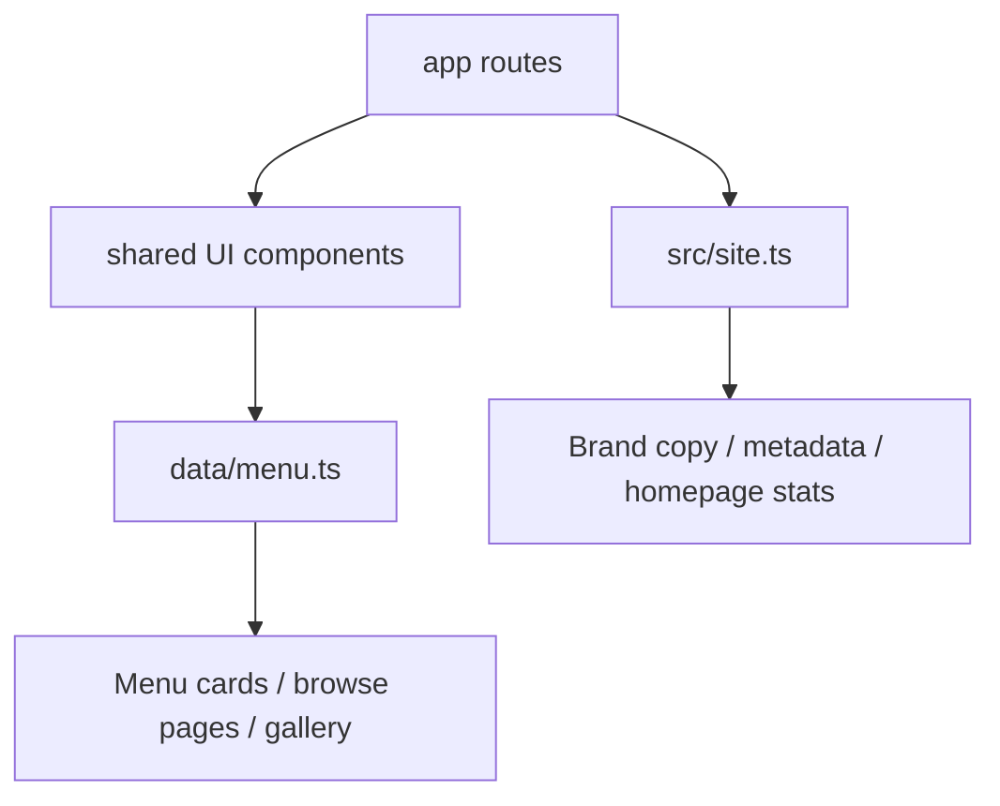
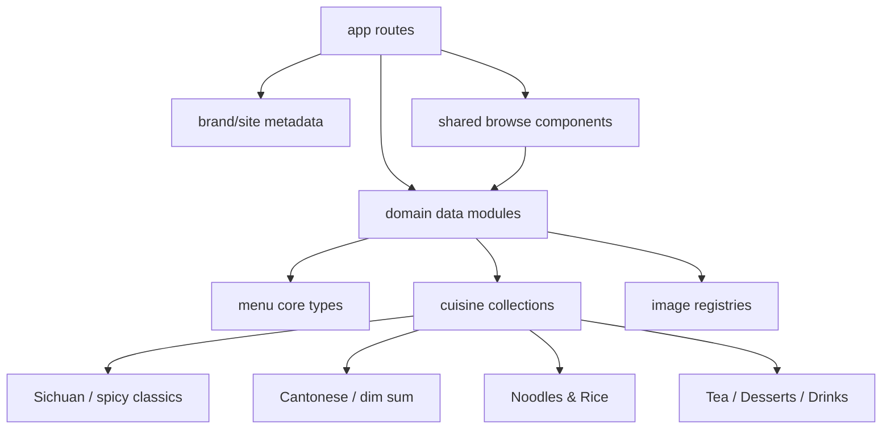
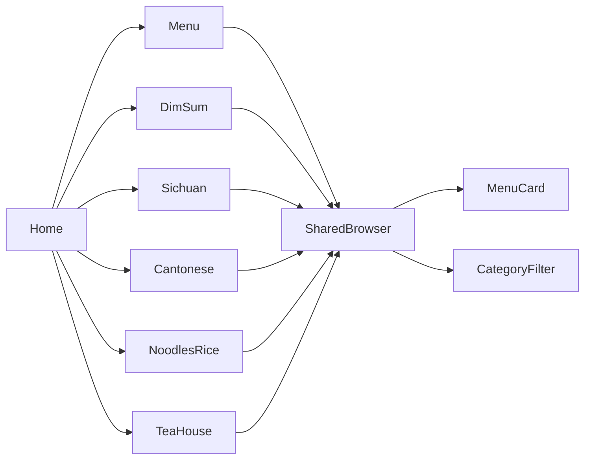

# KYM-1 Architect Plan — Remodel Website for Chinese Cuisine

## Terminal log
- inspected `package.json` → Next.js 14 App Router, React 18, TypeScript, Tailwind CSS
- inspected `src/site.ts` → brand metadata is fully Indian-restaurant specific and reused across the site
- inspected `data/menu.ts` → monolithic static menu dataset and taxonomy centered on Indian Thali / South Indian / North Indian / Tea
- inspected `app/page.tsx` → homepage copy, featured selections, and browse cards are Indian-cuisine specific
- inspected `components/Navbar.tsx` + `components/MenuBrowser.tsx` → global IA and menu filtering already assume Indian sections
- inspected `app/gallery/page.tsx`, `app/story/page.tsx`, `app/thalis/page.tsx`, `app/tea-house/page.tsx` → supporting routes are tightly coupled to Indian cuisine positioning
- created this architect handoff only; no product code changed in this phase

---

## Executive summary
This is not a light content swap. The current app is already a **purpose-built Indian restaurant website**, with Indian taxonomy, Indian copy, Indian landing pages, and Indian menu data threaded through the entire information architecture.

For **KYM-1**, the cleanest implementation path is a **systematic domain remodel from Indian to Chinese cuisine** while preserving the existing static architecture:
- keep **Next.js App Router + local TypeScript seed data**
- replace Indian-specific brand/story/menu taxonomy with Chinese-cuisine equivalents
- re-map regional landing pages to Chinese discovery paths
- reuse presentational components wherever possible
- keep route count and component structure stable unless a rename materially improves clarity

This should be executed as a **content-model and IA refactor**, not a backend rewrite.

---

## Current architecture snapshot



### Stack
- **Framework:** Next.js 14 App Router
- **UI:** React 18 + Tailwind CSS
- **Data source:** static local TypeScript data
- **Interaction model:** client-side filtering for menu browsing
- **Operational model:** no backend/API dependency required for this ticket

### What is strongly Indian-specific today
- `src/site.ts` brand = **Saffron Thali House**
- `data/menu.ts` categories = **Indian Thali / South Indian / North Indian / Tea / Desserts / Drinks**
- homepage and story copy explicitly mention dosas, chai, curries, thalis
- IA exposes `/thalis`, `/south-indian`, `/north-indian`, `/tea-house`
- gallery and featured sections are filtered around Indian categories

### Key constraint
Because the Indian identity is embedded in **data + copy + routing**, Grunt should avoid piecemeal edits. A partial swap will leave obvious cross-page inconsistencies.

---

## Problem framing
User request: **"Remodeling the Website For Chinese cuisine from Existing Indian Cuisine"**

Translated into implementation requirements:

1. Replace the cuisine identity across the site, not just on the homepage.
2. Replace the menu taxonomy with Chinese-friendly browse structures.
3. Keep the richer browse experience already present: dedicated cuisine pages, featured dishes, image-heavy menu coverage.
4. Preserve the existing technical simplicity: local data, reusable components, static routes.

---

## Recommended target architecture



### Architectural direction
Keep the current static architecture, but remodel the domain around **Chinese cuisine discovery**.

Recommended domain pivots:
- regional Chinese categories instead of Indian categories
- Chinese dish imagery pools instead of Indian imagery pools
- route-level landing pages for major Chinese browse intents
- homepage/story/gallery rewritten to match Chinese positioning

Do **not** add a backend, CMS, or dynamic API in this phase.

---

## ADR-001 — Replace Indian taxonomy with Chinese cuisine taxonomy

**Status:** Proposed  
**Decision owner:** Architect  
**Required by:** KYM-1

### Context
Current taxonomy is tightly aligned to Indian cuisine. Chinese cuisine needs a different browse vocabulary.

### Decision
Refactor the menu domain to categories such as:

```ts
export type MenuCategory =
  | 'Dim Sum'
  | 'Sichuan'
  | 'Cantonese'
  | 'Noodles & Rice'
  | 'Hot Pot & Clay Pot'
  | 'Tea'
  | 'Desserts'
  | 'Drinks';
```

Optionally keep a slimmer version if scope needs to stay tight:

```ts
'Dim Sum' | 'Sichuan' | 'Cantonese' | 'Noodles & Rice' | 'Tea' | 'Desserts' | 'Drinks'
```

### Rationale
This mirrors how customers actually browse Chinese food better than a flat generic menu.

### Trade-offs
- **Pros:** stronger domain fit, clearer landing pages, easy component reuse
- **Cons:** all seeded data and all copy references must be updated consistently

### Rollback plan
If the category migration gets too large, Grunt can preserve the existing component contracts and only swap the category string unions plus filter/copy values.

---

## ADR-002 — Re-map Indian landing pages to Chinese cuisine landing pages

**Status:** Proposed

### Context
The current landing pages are useful structurally, but the route purposes are Indian-specific.

### Decision
Retain the dedicated-page pattern but remap it to Chinese sections.

### Recommended route mapping
- `/menu` → keep as full master catalog
- `/dim-sum` → new high-intent browse page
- `/sichuan` → spicy mains and signature dishes
- `/cantonese` → lighter classics, roast, and shared plates
- `/noodles-rice` → noodle bowls, fried rice, buns, and comfort dishes
- `/tea-house` → can stay if positioned as Chinese tea / dessert / drinks

### Rationale
This preserves the improved IA while aligning it to the new cuisine.

### Trade-offs
- **Pros:** minimal architectural churn, strong customer discovery paths
- **Cons:** some route rename work and home/nav CTA changes required

### Rollback plan
If route churn is undesirable, Grunt can keep `/tea-house` but should rename Indian-only routes like `/thalis` and `/south-indian`.

---

## ADR-003 — Swap imagery to Chinese-food section registries

**Status:** Proposed

### Context
Current image pools are Indian-food specific. Keeping them would break visual credibility immediately.

### Decision
Create section-scoped Chinese image registries, e.g.:
- `dimSum`
- `sichuan`
- `cantonese`
- `noodlesRice`
- `tea`
- `desserts`
- `drinks`

### Rationale
Better visual coherence with minimal runtime complexity.

### Trade-offs
- **Pros:** large perception gain, static-friendly
- **Cons:** curation work to find enough distinct imagery

### Rollback plan
If image sourcing is the bottleneck, prioritize distinct pools for the main 4 Chinese browse sections first.

---

## Proposed information architecture

### Keep routes that are cuisine-agnostic
- `/`
- `/menu`
- `/gallery`
- `/story`
- `/events`
- `/order`
- `/reservations`
- `/contact`

### Replace Indian-specific routes
- replace `/thalis`
- replace `/south-indian`
- replace `/north-indian`
- rework `/tea-house`

### Recommended new routes
- `/dim-sum`
- `/sichuan`
- `/cantonese`
- `/noodles-rice`
- optional keep/rework: `/tea-house`

### Navigation recommendation
Primary nav should become:
- Home
- Menu
- Dim Sum
- Sichuan
- Cantonese
- Noodles & Rice
- Gallery
- Order
- Reservations
- Contact

If nav space is tight, `Story` or `Events` can stay secondary.

---

## Page/component mapping



### Components to reuse
- `MenuCard`
- `MenuBrowser`
- `CategoryFilter`
- `ImageShowcase`
- `SectionIntro`
- `StatsStrip`
- `Navbar`
- existing collection-page layout patterns

### New or renamed components only if needed
- probably **no mandatory new component abstractions**
- thin page wrappers over filtered menu data should be enough

### Guardrail
Do not fork bespoke category browsers for every Chinese page. Reuse the shared browser and shared menu-section layout pattern.

---

## Data design proposal

### Current data shape
- static tuple-based seed arrays
- `buildItems(...)` normalizes rows into `MenuItem`
- category descriptions feed filter descriptions

### Recommended new content structure
Keep the current shape, but replace the domain data with Chinese cuisine entries.

Suggested category content targets:
- **Dim Sum:** dumplings, buns, shumai, spring rolls, congee sides
- **Sichuan:** mapo tofu, kung pao, dry pot, dan dan noodles, chili-oil dishes
- **Cantonese:** roast duck/chicken, stir-fried greens, wonton noodle soups, steamed fish, clay pots
- **Noodles & Rice:** chow mein, lo mein, fried rice, rice bowls, hand-pulled noodle style entries
- **Tea:** jasmine tea, oolong, pu-erh, milk tea, herbal infusions
- **Desserts:** sesame balls, mango pudding, egg tarts, almond jelly
- **Drinks:** plum soda, soy milk, iced tea, fruit coolers

### Seed-data quality rules
- use recognizable dish names
- descriptions should identify preparation and texture fast
- keep vegetarian/spicy flags meaningful
- avoid obviously generic filler text
- keep price and prep-time bands internally coherent

### Dataset scale
Current dataset is already large enough for a full restaurant site. No exact new count is required by this task text, but Grunt should preserve roughly the same menu density so the site does not feel downgraded.

---

## File-level impact analysis

### Must-change files
- `src/site.ts`
- `data/menu.ts`
- `components/MenuBrowser.tsx`
- `components/Navbar.tsx`
- `components/HeroSection.tsx`
- `app/page.tsx`
- `app/gallery/page.tsx`
- `app/story/page.tsx`

### Route files to replace or rewrite
- `app/thalis/page.tsx`
- `app/south-indian/page.tsx`
- `app/north-indian/page.tsx`
- `app/tea-house/page.tsx`

### Recommended resulting route set
- `app/dim-sum/page.tsx`
- `app/sichuan/page.tsx`
- `app/cantonese/page.tsx`
- `app/noodles-rice/page.tsx`
- optionally keep `app/tea-house/page.tsx` with Chinese tea-house framing

### Likely low-risk unchanged files
- order/reservation form components unless they contain cuisine-specific copy
- app shell and global CSS unless branding color direction changes

---

## Scalability / maintainability assessment

### Scalability
Still fine as a static site. Main scaling issue is **content maintainability**, not traffic.

### Maintainability recommendation
If Grunt has time, splitting `data/menu.ts` into modular files would improve long-term clarity. But this is optional for KYM-1 if direct replacement inside the existing file is faster and safer.

### Team handoff clarity
- `src/site.ts` = global brand metadata
- `data/menu.ts` = cuisine catalog + filter taxonomy
- `app/*/page.tsx` = route-level story and browse composition
- `components/*` = shared presentational logic

---

## Migration plan for Grunt

### Phase 1 — Brand remodel
- change restaurant name, tagline, stats, occasions, and metadata in `src/site.ts`
- update layout metadata and navbar labels
- replace homepage hero copy and featured-section language

### Phase 2 — Menu taxonomy remodel
- replace Indian category union with Chinese cuisine categories
- replace category descriptions
- replace all menu seed arrays with Chinese dishes
- replace image pools with Chinese-food imagery

### Phase 3 — Route remodel
- remove or rewrite Indian-specific route pages
- add Chinese landing pages (`/dim-sum`, `/sichuan`, `/cantonese`, `/noodles-rice`)
- reframe `/tea-house` as Chinese tea/dessert/beverage experience if retained

### Phase 4 — Experience polish
- update gallery selections to showcase Chinese sections
- update story page to explain the Chinese cuisine concept
- scan order/contact/events/reservation copy for stray Indian references

---

## Suggested acceptance criteria
- no visible Indian-cuisine framing remains in primary user-facing browse paths
- homepage, nav, story, gallery, and menu all read as a Chinese restaurant site
- menu filtering works with the new Chinese taxonomy
- dedicated Chinese browse pages exist for major sections
- images align with Chinese dishes instead of Indian food
- build remains clean and the site structure stays coherent

---

## Risks
| Risk | Impact | Likelihood | Mitigation |
|---|---:|---:|---|
| Indian references remain in secondary pages | High | Medium | full-text scan after implementation |
| Route/content mismatch after renames | Medium | Medium | update homepage cards + nav together |
| Chinese taxonomy feels too generic | Medium | Medium | use strong region/format labels like Dim Sum and Sichuan |
| Image mismatch damages credibility | High | High | replace image pools early |
| Over-refactor slows delivery | Medium | Medium | keep architecture static and reuse components |

---

## Recommendation to Grunt
Treat KYM-1 as a **cohesive cuisine-domain conversion**.

Best path:
1. swap the brand and homepage copy,
2. replace the menu taxonomy and seeded dishes,
3. remap the Indian landing pages to Chinese cuisine pages,
4. update gallery/story/supporting copy,
5. finish with a scan for leftover Indian references.

This delivers the biggest visible transformation with the least technical risk.

ARCHITECT_DONE: plan ready for Grunt.
