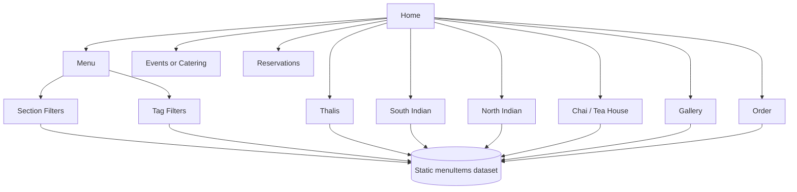

# AKA-81 Architect Plan — Indian Restaurant Content Expansion

## Terminal Log
- inspected repo tree with `find . -maxdepth 3 -type f | sort | head -300`
- reviewed stack in `package.json`
- reviewed current feed model in `data/menu.ts`
- reviewed shared brand metadata in `src/site.ts`
- reviewed current route/component entry points:
  - `app/page.tsx`
  - `app/menu/page.tsx`
  - `app/gallery/page.tsx`
  - `app/events/page.tsx`
  - `app/order/page.tsx`
  - `app/story/page.tsx`
  - `components/MenuBrowser.tsx`
  - `components/MenuCard.tsx`
  - `components/ImageShowcase.tsx`
  - `components/Navbar.tsx`
- wrote this plan artifact to `memory-bank/AKA-81-architect-plan.md`

## Scope Summary
The current site is structurally solid, but the domain content is still modeled as a generic Western restaurant. Ticket AKA-81 asks for a stronger, more localized content system:

- keep the existing polished experience
- feed at least 100 items with good quality images
- re-theme the offering toward Indian cuisine
- explicitly cover:
  - Indian thali
  - South Indian
  - North Indian
  - tea
- add more pages and make the site feel richer overall
- this phase is planning only; no implementation in Architect phase

## Current Stack Assessment

### Stack
- Next.js 14 App Router
- React 18
- TypeScript
- Tailwind CSS
- Static local content model in TypeScript (`data/menu.ts`)
- No backend/API dependency

### Existing strengths
- clean static architecture
- strong route-level separation
- reusable card/gallery/menu components
- image-backed content already supported
- 100-item feed already exists as a baseline pattern

### Main architectural gap
The app architecture is fine; the domain model is not. Right now the system is optimized around broad generic categories:
- `Starters`
- `Mains`
- `Desserts`
- `Drinks`

That structure is too coarse for the new information architecture. The biggest change should be to the data model and category taxonomy, not to the framework.

---

# ADR-001 — Reframe the menu feed from generic categories to Indian cuisine collections

## Status
Proposed

## Context
The current menu taxonomy cannot express the requested browsing modes cleanly. Users want cuisine-led discovery, not just course-led discovery. "Indian thali", "South Indian", "North Indian", and "tea" are not cosmetic labels; they are primary navigation concepts.

## Decision
Retain the static local-data architecture, but expand the content schema to support:
- primary section/category
- regional/cuisine tags
- service-type tags
- richer image metadata

### Recommended data model revision
Add these fields to each `MenuItem`:
- `section`: one of `Thali | South Indian | North Indian | Street Food | Desserts | Tea | Drinks`
- `tags`: string[] for filters such as `vegetarian`, `spicy`, `breakfast`, `chai`, `tandoor`, `dosa`, `curry`, `festival`
- `region`: one of `North Indian | South Indian | Pan-Indian | Indo-Chinese | Beverage`
- `imageAlt`: accessible descriptive alt text
- optional `badge`: e.g. `Chef Pick`, `Popular`, `New`, `Best for Sharing`

Keep existing fields:
- `id`
- `name`
- `price`
- `description`
- `image`
- `featured`
- `spicy`
- `vegetarian`
- `calories`
- `prepTime`

### Why this is the right boundary
This keeps components mostly unchanged while allowing the UI to pivot from a Western menu to an Indian discovery experience. It preserves low implementation risk while materially improving the user-facing information architecture.

## Consequences
### Benefits
- minimal component churn
- zero API breaking changes at route level
- much stronger browsing semantics
- easy to add future sections like biryani, kebabs, breakfast, sweets, regional specials

### Costs
- requires coordinated update across data module, filters, copy, and some pages
- some component props may need rename/generalization from `category` to `section`

### Risks
- if Grunt only swaps names and not taxonomy, the result will still feel generic
- image quality may remain repetitive if only a few URLs are reused

---

# ADR-002 — Keep static content delivery, but curate higher-entropy image coverage

## Status
Proposed

## Context
Current imagery is category-reused. That is adequate for a demo, but weak for a cuisine-driven showcase. Indian cuisine pages need visual distinction across thalis, dosas, curries, breads, sweets, and tea service.

## Decision
Continue using remote image URLs, but restructure image assignment so image reuse happens per micro-collection instead of per broad category.

### Recommended image strategy
Create image pools such as:
- `thaliImages`
- `southIndianImages`
- `northIndianImages`
- `teaImages`
- `dessertImages`
- optional `streetFoodImages`

Each pool should have enough unique high-quality images to avoid obvious duplication in adjacent cards.

### Quality bar
- prefer plated, restaurant-quality images
- avoid low-light or generic stock scenes
- ensure `next.config.js` remote image allowance supports the chosen hostnames
- ensure alt text reflects dish and presentation

## Consequences
### Benefits
- stronger perceived quality immediately
- gallery page becomes credible rather than repetitive
- homepage featured section feels more premium

### Costs
- more curation effort in the dataset
- potential need to update remote image config if new hosts are used

### Rollback plan
If unique image coverage causes instability, fall back to a single trusted domain and a smaller curated set while preserving the new taxonomy.

---

# ADR-003 — Expand navigation with cuisine-led and experience-led pages

## Status
Proposed

## Context
The current site already has more than the original minimum page count, but new domain-specific pages will convert better than generic filler pages.

## Decision
Add pages that reinforce the Indian dining concept and expose the new taxonomy directly.

### Recommended new pages
1. `/thalis`
   - hero + overview of veg/non-veg/family thalis
   - curated thali cards
   - CTA to order/reserve

2. `/south-indian`
   - dosa, idli, uttapam, vada, filter coffee highlights
   - breakfast + all-day subgroups

3. `/north-indian`
   - curries, kebabs, naan, biryani, paneer, tandoor focus

4. `/tea-house` or `/chai`
   - masala chai, cutting chai, saffron tea, herbal infusions
   - snack pairing callouts

Optional fifth page if time allows:
5. `/catering`
   - family packs, office lunch trays, festival platters, wedding/event catering

### Navigation impact
Navbar should prioritize:
- Home
- Menu
- Thalis
- South Indian
- North Indian
- Tea / Chai
- Gallery
- Events or Catering
- Order
- Reservations
- Contact

## Consequences
### Benefits
- clearer information scent
- improved SEO-style route segmentation
- better support for the user request than a generic gallery/story expansion alone

### Costs
- more route files and copy
- higher risk of duplicated page structure if not templated carefully

### Maintainability note
Keep these pages composition-based using shared sections; do not fork bespoke one-off layouts for every page.

---

# ADR-004 — Convert filtering from single-category to multi-axis discovery

## Status
Proposed

## Context
A single `All / Starters / Mains / Desserts / Drinks` control is no longer enough. The content request implies multiple browse paths.

## Decision
Upgrade `MenuBrowser` to support at least two axes:
- primary section tabs
- lightweight tag chips / secondary filters

### Recommended filtering UX
Primary tabs:
- All
- Thali
- South Indian
- North Indian
- Tea
- Desserts

Secondary chips:
- Vegetarian
- Spicy
- Best Seller
- Breakfast
- Tandoor
- Chai

### Data flow
- source of truth remains local array in `data/menu.ts`
- derived filtered lists via `useMemo`
- no server dependency

## Consequences
### Benefits
- meaningful discovery without backend complexity
- independent scaling of content and UI
- keeps component graph simple

### Reliability / operability note
Keep filtering client-only and deterministic. No async state, no loading modes, no new failure class.

---

# ADR-005 — Preserve existing route contract; implement additive migration only

## Status
Proposed

## Context
Guardrails require zero API breaking changes. Even though there is no external API, route stability matters.

## Decision
Do not remove current routes. Add new routes and retheme existing ones.

### Route strategy
Retain:
- `/`
- `/menu`
- `/gallery`
- `/story`
- `/events`
- `/order`
- `/reservations`
- `/contact`

Add:
- `/thalis`
- `/south-indian`
- `/north-indian`
- `/tea-house` or `/chai`
- optional `/catering`

### Migration path
Phase 1:
- replace menu data and homepage/story/events copy
- add new route cards on home
- update navbar

Phase 2:
- add cuisine-led landing pages using shared components
- improve gallery segmentation by cuisine

Phase 3:
- upgrade menu filters and ordering highlights

## Rollback plan
Because changes are additive and local-content based, rollback is straightforward:
- revert new routes
- restore previous data/menu.ts
- restore previous copy in `src/site.ts` and home/story/events pages

Blast radius remains low because there is no backend schema migration.

---

## Proposed Information Architecture

## Component Plan

### Reuse as-is or with minor copy changes
- `HeroSection`
- `SectionIntro`
- `MenuCard`
- `ImageShowcase`
- `OccasionGrid`
- `StatsStrip`
- `OrderExperience`
- `ReservationForm`

### Components likely needing targeted refactor
- `Navbar`
  - update route map
- `MenuBrowser`
  - switch from single-axis category model to richer section/tag model
- `CategoryFilter`
  - rename conceptually to section filter or extend to support chips
- `MenuCard`
  - optionally show region/badge metadata

### New recommended shared components
- `CuisineHighlightGrid`
- `TeaPairingSection`
- `ThaliComparisonTable` or simplified plan cards
- `RegionalFeatureStrip`

Do not over-abstract unless repetition actually appears across 3+ pages.

## Page-Level Implementation Plan for Grunt

### 1. Homepage (`app/page.tsx`)
Replace generic messaging with Indian restaurant positioning.

Recommended sections:
- hero: Indian thalis, regional plates, chai, desserts
- stats: 100+ dishes, regional coverage, tea selection, family platters
- featured dishes: mix of thalis, dosa, butter chicken, biryani, chai
- route cards: Thalis, South Indian, North Indian, Tea House, Catering
- gallery teaser by cuisine

### 2. Menu (`app/menu/page.tsx` + `components/MenuBrowser.tsx`)
Refactor into a richer browse experience.

Required outcomes:
- 100+ items still guaranteed
- tabs for new sections
- optional chips for dietary/style filters
- counts shown per section

### 3. Gallery (`app/gallery/page.tsx`)
Segment by cuisine instead of arbitrary slices.

Recommended layout:
- Thali spread
- South Indian breakfast & dosa section
- North Indian tandoor/curry section
- Tea & sweets section

### 4. Story (`app/story/page.tsx`)
Reframe brand story around:
- regional cooking inspiration
- family-style serving and thali culture
- tea/snack ritual

### 5. Events page (`app/events/page.tsx`) or Catering page
If editing events:
- reposition for festive dining, office lunch trays, family gatherings, wedding events

If adding catering page:
- make it the operational page for bulk orders and group platters

### 6. New pages
#### `app/thalis/page.tsx`
- show veg thali / deluxe thali / family thali / festival thali
- emphasize complete-meal bundles

#### `app/south-indian/page.tsx`
- dosa, idli, vada, pongal, uttapam, filter coffee

#### `app/north-indian/page.tsx`
- paneer, dal makhani, naan, kebabs, biryani, curries

#### `app/tea-house/page.tsx` or `app/chai/page.tsx`
- tea menu, chai flights, tea-time snacks, pairings

## Data Plan

### Minimum dataset target
At least 100 entries, but do not stop exactly at 100 if natural segmentation lands at 110–130.

### Suggested distribution
- Thali: 18–24
- South Indian: 24–30
- North Indian: 24–30
- Street food/snacks: 10–16
- Desserts/sweets: 10–14
- Tea/chai/beverages: 14–20

### Naming quality bar
Avoid filler names. Prefer specific items such as:
- Rajwadi Veg Thali
- Mini Tiffin Thali
- Mysore Masala Dosa
- Ghee Roast Dosa
- Medu Vada Sambar
- Paneer Lababdar
- Dal Makhani
- Amritsari Kulcha
- Kashmiri Kahwa
- Masala Chai
- Cutting Chai
- Elaichi Tea
- Filter Coffee

Descriptions should sound restaurant-ready, not placeholder-generated.

## Scalability Assessment

### Growth model
Current app is static and scales mostly with page weight, not backend load.

### 10x / 100x concerns
- 10x content: still fine in static TypeScript if component rendering stays simple
- 100x content: client-side filtering may become heavy, but nowhere near a problem at 100–150 items
- primary bottleneck is image payload size, not compute

### Independent scaling
- content can scale independently from routes
- route count can scale independently from data if pages consume filtered subsets
- keep image set modular to avoid monolithic data maintenance pain

## Reliability Assessment

### Failure modes
- broken remote images
- missing filter tags causing empty sections
- Next image domain mismatch
- overlarge pages hurting LCP

### Graceful degradation
- cards should still render if some optional metadata is absent
- do not make pages depend on perfect tag completeness
- if image hosts fail, keep text-first cards usable

### Blast radius
- localized to content/rendering only
- no checkout/payment backend, so no transactional outage risk

## Maintainability Assessment

### One-day comprehension test
A new engineer should understand this in under a day if:
- all menu definitions live in one data file or a small set of sectional files
- naming is consistent (`section`, `region`, `tags`)
- pages are composed from shared components

### Ownership boundaries
- `data/` owns content schema
- `components/` owns rendering primitives
- `app/` owns route composition
- `src/site.ts` owns business/brand metadata

### Dependency graph
Keep acyclic:
- `data` -> no UI imports
- `components` -> may import `data` types only
- `app` -> imports components and data

Block any circular dependency introduced by page-specific helper imports back into shared data/components.

## Operability / Observability
Even in a static app, observability still matters.

### Required checks for Grunt
- `npm run build`
- smoke-check all primary routes
- confirm dataset count programmatically if convenient
- verify remote image hosts accepted by Next config

### Suggested lightweight artifact for handoff
Add/update `docs/IMPLEMENTATION_NOTES.md` with:
- final item count
- route list
- category distribution
- any image host changes

### Runbook notes
If gallery/menu looks broken in production, first inspect:
1. image host allowlist
2. malformed menu item fields
3. section/tag filter assumptions

## Concrete task list for Grunt
1. Redesign `data/menu.ts` around Indian sections and richer metadata.
2. Keep total items at 100+ with strong naming and descriptions.
3. Curate more varied, high-quality images aligned to cuisine groups.
4. Update `src/site.ts` branding to an Indian restaurant concept.
5. Update homepage copy and route cards.
6. Refactor menu filtering to support section-led browsing.
7. Add new pages for Thalis, South Indian, North Indian, and Tea/Chai.
8. Rework gallery sections to reflect cuisine clusters.
9. Reposition story/events copy around the new domain.
10. Validate build and route rendering.
11. Update implementation notes for Pedant/Scribe handoff.

## Non-goals for this ticket
- no backend CMS
- no payment integration
- no reservation API
- no search service
- no dynamic personalization

## Handoff Notes for Pedant and Scribe
- Pedant should verify content consistency more than code cleverness:
  - correct Indian taxonomy
  - no broken route links
  - image domain compatibility
  - section counts add up to 100+
  - copy quality feels intentional, not filler
- Scribe should summarize this as a domain/content architecture upgrade, not a framework rewrite.

ARCHITECT_DONE: plan ready for Grunt.
